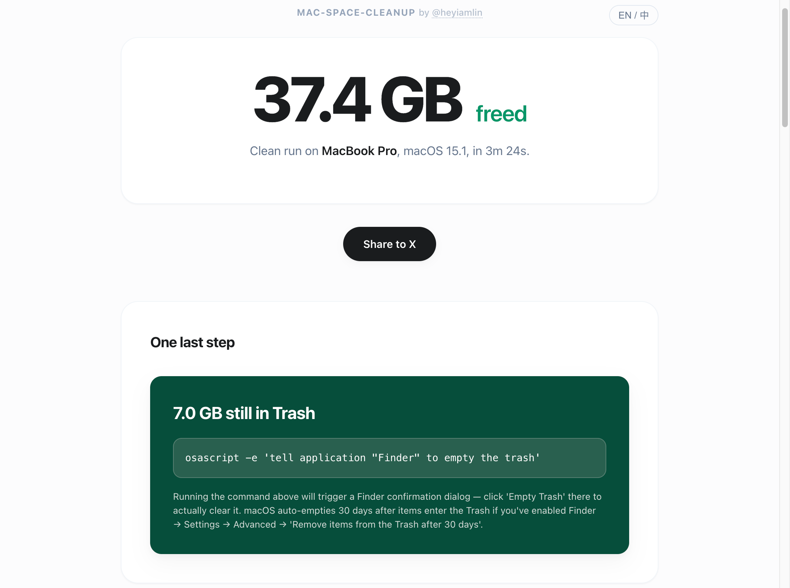
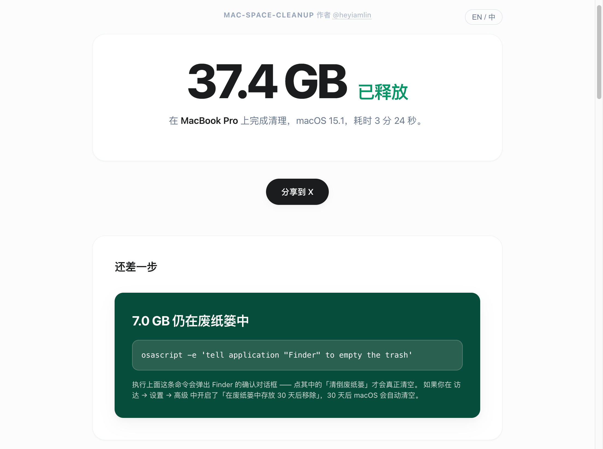

# mac-space-cleanup skill

[English](README.md) · [简体中文](README.zh-CN.md) · [繁體中文](README.zh-TW.md) · [日本語](README.ja.md) · [Español](README.es.md) · [Français](README.fr.md) · [العربية](README.ar.md) · **Deutsch**

Ein **skill**, der den Speicherplatz deines Macs bereinigt — umsichtig, ehrlich, mehrstufig.

> Der Skill führt den Agenten durch eine siebenstufige Bereinigung (Modus → Probe → Scan → Klassifikation → Bestätigung → Report → Öffnen) mit **L1–L4-Risikoeinstufung**, **ehrlicher Freispeicher-Bilanzierung** (aufgeteilt in `freed_now` / `pending_in_trash` / `archived`) und **mehreren Sicherheitsnetzen** (eine deterministische Blockliste im Code, ein Sub-Agent zur Privatsphären-Prüfung und ein Validator nach dem Rendering). Null pip-Abhängigkeiten — nur macOS-Befehle und die Python-Standardbibliothek.

---

## Warum dieses Skill

Klassische Cleaner (CleanMyMac, OnyX) arbeiten mit festen Regeln —— **sie können deine Situation nicht beurteilen**, sie unterscheiden nicht zwischen aktivem und verlassenem `node_modules` oder zwischen unersetzlichen Daten und Müll-Cache. Ein ungeschützter Agent ("Claude, räum meinen Mac auf") hat dieses Urteil, aber **keine Guardrails** —— eine falsche Entscheidung und `rm -rf` trifft deine `.git`, `.env` oder Keychains.

Dieses Skill verbindet beides: das Urteil des Agents vorne, die deterministische Blocklist von `safe_delete.py` dahinter. **Das Urteil dem Agent, die letzte Linie der Blocklist.**

---

<!-- skillx:begin:setup-skillx -->
## Mit skillx ausprobieren

[](https://skillx.run)

Führe diesen Skill ohne Installation aus:

```bash
skillx run --skip-scan --auto https://github.com/skillx-run/mac-space-cleanup "Räum auf meinem Mac auf."
```

Erst eine Vorschau? Füge `--dry-run` zur Nachricht hinzu. Das Skill durchläuft alle sieben Stufen, aber `safe_delete.py` schreibt nichts ins Dateisystem (nur das `actions.jsonl` im workdir).

```bash
skillx run --skip-scan --auto https://github.com/skillx-run/mac-space-cleanup "Räum auf meinem Mac auf mit --dry-run, nur Vorschau, ohne wirklich etwas zu löschen."
```

Angetrieben von [skillx](https://skillx.run) — ein Befehl, der jeden Agent-Skill holt, scannt, injiziert und aufräumt.
<!-- skillx:end:setup-skillx -->

---

## Demo

Der Report wird in die Sprache **lokalisiert**, mit der du den Skill ausgelöst hast — eine Sprache pro Lauf, kein Umschalter zur Laufzeit. Englisch ausgelöst → englischer Report; Chinesisch → chinesischer Report; Japanisch, Spanisch, Französisch usw. → in dieser Sprache. Unten: erster Eindruck (EN links, ZH rechts, beide aus getrennten Läufen), darunter Links zu den Ganzseiten-Aufnahmen. Aktuell stellen wir nur englische und chinesische Screenshots als Beispiel bereit; der Skill selbst erzeugt den vollständigen Report in **der Sprache dieser Seite** (Deutsch), wenn du ihn so auslöst.

<table>
<tr>
<td width="50%"></td>
<td width="50%"></td>
</tr>
</table>

Vollständiger Report (Wirkungsübersicht · Aufschlüsselung · Detailprotokoll · Beobachtungen · Laufdetails · L1–L4-Risikoverteilung):
[Ganze Seite Englisch](assets/mac-space-cleanup.full.en.png) · [Ganze Seite Chinesisch](assets/mac-space-cleanup.full.zh.png)

---

## Install

Jedes Agent-Harness, das Skills lädt, kann dies verwenden. Der untenstehende Ausschnitt nutzt den geläufigen Pfad `~/.claude/skills/`; passe ihn an das Skills-Verzeichnis deines Harnesses an, falls es anders heißt.

```bash
git clone git@github.com:skillx-run/mac-space-cleanup.git
mkdir -p ~/.claude/skills
ln -s "$(pwd)/mac-space-cleanup" ~/.claude/skills/mac-space-cleanup
```

Lade anschließend dein Harness neu, damit die Skill-Liste den neuen Eintrag aufnimmt (bei den meisten Harnesses: einfach eine neue Sitzung öffnen).

### Recommended optional dependency

```bash
brew install trash
```

Fehlt das CLI `trash`, fällt `safe_delete.py` darauf zurück, Dateien mit `mv` in `~/.Trash` zu verschieben (mit einem Suffix `-<timestamp>`) — funktioniert, sieht im Finder aber etwas seltsam aus. Der Skill macht dich beim ersten Lauf selbst darauf aufmerksam.

---

## Use

Sag in deiner Agent-Konversation etwas wie:

| Du sagst… | Der Skill wählt |
| --- | --- |
| „schnelle Bereinigung", „mach mir schnell Platz", „kurz durchwischen" | Modus `quick` (räumt risikoarme Punkte automatisch auf, ~30 s) |
| „tiefe Bereinigung", „analysiere den Speicherplatz", „finde die großen Brocken" | Modus `deep` (vollständiges Audit, fragt pro Element bei riskanten Dingen, ~2–5 min) |
| „räume meinen Mac auf", „mein Mac ist voll" (mehrdeutig) | Der Skill fragt nach, welchen Modus du willst, mit Zeitschätzungen |

Für eine Vorschau ohne Dateisystem-Eingriffe hängst du `--dry-run` an deine Nachricht an:

> "Räum auf meinem Mac auf mit --dry-run, nur Vorschau, ohne wirklich etwas zu löschen."

Der Report zeigt oben sichtbar `DRY-RUN — no files touched` (in die Auslösesprache übersetzt) und stellt jeder Zahl das zielsprachliche Äquivalent von „würden freigegeben" voran.

### Report language

Der HTML-Report ist **einsprachig pro Lauf** und wird in der Sprache erzeugt, mit der du den Skill ausgelöst hast. Der Agent erkennt die Konversationssprache aus der Auslösenachricht, schreibt ihren Wert (ein BCP-47-Subtag wie `en`, `zh`, `ja`, `es`, `ar`) in den workdir und verfasst dann jeden natürlichsprachigen Knoten — Hero-Überschrift, Aktions-Begründungen, Beobachtungen, source_label-Darstellungen, dry-run-Prosa — direkt in dieser Sprache. Statische Bezeichner (Abschnittstitel, Schaltflächen-Text, Spaltenköpfe) liegen im Template als englische Basis vor; bei nicht-englischen Läufen übersetzt der Agent sie einmalig in ein eingebettetes Wörterbuch, das die Seite beim Laden hydriert. Kein Laufzeit-Umschalter, kein zweisprachiges DOM — die Konversationssprache gewinnt.

Rechts-nach-links-Schriften (Arabisch, Hebräisch, Persisch) erhalten `<html dir="rtl">`; die grundlegende Richtungsumkehr funktioniert, feinjustiertes RTL-CSS ist eine bekannte Einschränkung.

---

## What it touches (and never touches)

**Räumt auf** (mit Risikoeinstufung gemäß `references/category-rules.md`):

- Entwickler-Caches: Xcode DerivedData, Docker build cache, Go build cache, Gradle cache, ccache, sccache, JetBrains, Flutter SDK, Editor-Caches der VSCode-Familie (Code / Cursor / Windsurf / Zed `blob_store`).
- Paketmanager-Caches: Homebrew, npm, pnpm, yarn, pip, uv, Cargo, CocoaPods, RubyGems, Bundler, Composer, Poetry, Dart pub, Bun, Deno, Swift PM, Carthage. Versionsmanager (nvm / fnm / pyenv / rustup) zeigen nicht aktive Einträge pro Version an; aktive Pins werden automatisch aus den `.python-version` / `.nvmrc` jedes Projekts gelesen.
- AI/ML-Modell-Caches: HuggingFace (`hub/` L2 trash, `datasets/` L3 defer), PyTorch hub, Ollama (L3 defer; im deep-Modus dispatcht pro Modell über `ollama:<name>:<tag>` mit Referenzzählung der Blobs, sodass zwischen Tags geteilte Layer das Löschen eines Geschwister-Tags überleben), LM Studio, OpenAI Whisper, globaler Weights-&-Biases-Cache. Nicht-`base`-Envs von Conda / Mamba / Miniforge über die sieben gängigen macOS-Installationslayouts.
- Frontend-Tooling: Playwright-Browser + Driver, von Puppeteer mitgelieferte Browser.
- iOS/watchOS/tvOS-Simulator-Runtimes (über `xcrun simctl delete`, **niemals `rm -rf`**). iOS-`DeviceSupport/<OS>`-Einträge, deren major.minor mit einem aktuell gekoppelten physischen Gerät oder einer verfügbaren Simulator-Runtime übereinstimmt, werden automatisch auf L3 defer herabgestuft.
- App-Caches unter `~/Library/Caches/*`, saved application state und die Trash selbst. Caches kreativer Anwendungen (Adobe Media Cache / Peak Files, Final Cut Pro, Logic Pro) erscheinen unter spezifischen Labels statt im generischen `"System caches"`-Bucket.
- Logs, Absturzberichte.
- Alte Installer in `~/Downloads` (`.dmg / .pkg / .xip / .iso`, älter als 30 Tage).
- Lokale Time-Machine-Snapshots (über `tmutil deletelocalsnapshots`).
- **Projekt-Build-Artefakte** (nur deep-Modus, gescannt von `scripts/scan_projects.py` für jedes Verzeichnis mit `.git`-Wurzel):
  - L1 löschen: `node_modules`, `target`, `build`, `dist`, `out`, `.next`, `.nuxt`, `.svelte-kit`, `.turbo`, `.parcel-cache`, `__pycache__`, `.pytest_cache`, `.tox`, `.mypy_cache`, `.ruff_cache`, `.dart_tool`, `.nyc_output`, `_build` (nur Elixir-Projekte), `Pods`, `vendor` (nur Go-Projekte).
  - L2 in den Trash: `.venv`, `venv`, `env` (Python-venvs — Wheel-Pins reproduzieren eventuell nicht exakt, daher das Recovery-Fenster); `coverage` (Test-Coverage-Reports, gebunden an `package.json` oder einen Python-Marker); `.dvc/cache` (content-adressierter DVC-Cache, gebunden an einen Geschwister-Marker `.dvc/config` — das Elternverzeichnis `.dvc/` enthält Nutzerstatus und bleibt erhalten).
  - System- / Paketmanager-Verzeichnisse (`~/Library`, `~/.cache`, `~/.npm`, `~/.cargo`, `~/.cocoapods`, `~/.gradle`, `~/.m2`, `~/.gem`, `~/.bundle`, `~/.composer`, `~/.pub-cache`, `~/.local`, `~/.rustup`, `~/.pnpm-store`, `~/.Trash`) werden bei der Projekterkennung ausgeschlossen.
- **Im deep-Modus werden zusätzlich Verzeichnisse unter `~` mit ≥ 2 GiB angezeigt, die keine andere Regel erfasst hat** (L3 defer, `source_label="Unclassified large directory"`), damit echte verwaiste Disk-Hogs für manuelle Sichtung sichtbar werden. Vor der endgültigen Einstufung führt der Agent eine kurze nur-lesende Untersuchung durch (maximal 6 Befehle pro Kandidat), um `category` und `source_label` zu verfeinern; die Risiko-Stufe L3 defer bleibt dabei unabhängig vom Ergebnis gesperrt.

**Harter Riegel — verweigert unabhängig davon, was `confirmed.json` sagt** (siehe `_BLOCKED_PATTERNS` in `scripts/safe_delete.py`):

- Verzeichnisse `.git`, `.ssh`, `.gnupg`.
- `~/Library/Keychains`, `~/Library/Mail`, `~/Library/Messages`, `~/Library/Mobile Documents` (iCloud Drive).
- Photos-Mediathek, Apple-Music-Mediathek.
- `.env*`-Dateien, SSH-Schlüsseldateien (`id_rsa`, `id_ed25519`, …).
- Editor-State der VSCode-Familie: `{Code, Cursor, Windsurf}/{User, Backups, History}` (ungespeicherte Änderungen, git-stash-Äquivalente, lokale Bearbeitungshistorie).
- `Auto-Save`-Ordner der kreativen Adobe-Apps — ungespeicherte Premiere- / After-Effects- / Photoshop-Projektdateien.

Der Agent selbst liest die nutzer­orientierte Whitelist/Blacklist in `references/cleanup-scope.md` — die obige Blockliste ist die zur Laufzeit erzwungene Teilmenge.

---

## Architecture (one paragraph)

`SKILL.md` ist der Workflow-Vertrag — der Agent übernimmt das Urteilsvermögen (Moduswahl, Klassifikation, Dialog, HTML-Rendering). Zwei kleine Python-Skripte erledigen das, was der Agent nicht sollte: `scripts/safe_delete.py` ist der **einzige** Pfad, über den fs-Schreiboperationen stattfinden (sechs dispatchte Aktionen: delete / trash / archive / migrate / defer / skip; idempotent; Fehler­isolation pro Element; nur-anhängendes `actions.jsonl`); `scripts/collect_sizes.py` führt `du -sk` parallel aus, mit 30-s-Timeout pro Pfad und strukturierter JSON-Ausgabe. Drei Referenzdokumente (`references/`) sind die Wissensbasis des Agenten. Drei Asset-Templates (`assets/`) bilden das Skelett, das der Agent mit dem Report füllt. Zwei Reviewer/Validator-Schichten in Stage 6 fangen Privatsphären-Lecks ab, bevor der Nutzer den Report sieht. Der workdir pro Lauf liegt unter `~/.cache/mac-space-cleanup/run-XXXXXX/`.

---

## Honesty contract

Jedes Speicher-Aufräumtool bläht seine „N GB frei"-Zahl auf, indem es zählt, was in den Trash geschoben wurde. macOS gibt diesen Platz erst frei, wenn du `~/.Trash` leerst. Dieser Skill zerlegt die Metrik:

- `freed_now_bytes` — tatsächlich von der Platte runter (delete + migrate auf ein anderes Volume).
- `pending_in_trash_bytes` — liegt noch in `~/.Trash`; der Report bietet eine einzeilige `osascript`-Zeile zum Leeren.
- `archived_source_bytes` / `archived_count` — Bytes, die in einem tar im workdir verpackt wurden.
- `reclaimed_bytes` — rückwärtskompatibles Alias = `freed_now + pending_in_trash`. Der Share-Text und die Report-Überschrift verwenden `freed_now_bytes`, nicht dieses Feld.

---

## Project layout

```
mac-space-cleanup/
├── SKILL.md                      # Haupt-Agent-Workflow (sieben Stufen)
├── scripts/
│   ├── safe_delete.py            # Sechs-Aktions-Dispatcher + Blocklist-Riegel
│   ├── collect_sizes.py          # paralleles du -sk
│   ├── scan_projects.py          # findet .git-wurzelnde Projekte + listet bereinigbare Artefakte
│   ├── aggregate_history.py      # laufübergreifender Konfidenz-Aggregator (Stage 5 HISTORY_BY_LABEL) + run-*-GC
│   ├── validate_report.py        # Prüfung nach dem Rendering (Regionen / Placeholders / Lecks / dry-run-Markierung)
│   ├── smoke.sh                  # Smoke gegen echtes fs
│   └── dry-e2e.sh                # End-to-end-Harness ohne LLM
├── references/
│   ├── cleanup-scope.md          # Whitelist / Blacklist (mit Querverweis auf die safe_delete-Blocklist)
│   ├── safety-policy.md          # L1-L4-Einstufung + Schwärzung + Degradierung
│   ├── category-rules.md         # 10 Kategorien mit Mustern + risk_level + action
│   └── reviewer-prompts.md       # Prompt-Template für den Schwärzungs-Sub-Agenten
├── assets/
│   ├── report-template.html      # HTML-Skelett mit sechs Regionen und Paar-Markern
│   ├── report.css
│   └── share-card-template.svg   # 1200×630 X-Share-Karte
├── tests/                        # reine Standardbibliotheks-unittest-Suite
├── CHANGELOG.md
├── CLAUDE.md                     # Contributor-Invarianten
└── .github/workflows/ci.yml      # macos-latest: tests + smoke + dry-e2e
```

---

## Limitations & non-goals (v0.11.0)

- **Kein Undo-Stack.** Wiederherstellungswege sind der native Trash, die `archive/`-tar-Dateien im workdir und das migrate-Zielvolume.
- **Kein cron / kein Hintergrundlauf.** Jeder Lauf wird vom Nutzer ausgelöst.
- **Keine Cloud / keine Telemetrie.** Der workdir bleibt lokal.
- **Keine SIP-geschützten Pfade**, keine Deinstallation von `/Applications/*.app`.
- **Projektwurzel-Erkennung ausschließlich über `.git`.** Nackte git-Checkouts werden erkannt; Projekt-Arbeitsbereiche ohne `.git`-Verzeichnis nicht. Verschachtelte git-Submodule werden dedupliziert (erscheinen nicht als eigene Projekte).
- **Die Artefakt-Erkennung respektiert `.gitignore` nicht** — sie scannt feste Unterverzeichnis-Konventionsnamen (`node_modules`, `target`, …). Kann ein von git ignoriertes Verzeichnis zutage fördern und ein konventionsfremdes Verzeichnis übersehen.
- **Einzelrechner-Validierung.** Entwickelt und getestet auf macOS 25.x / 26.x mit Entwickler-Toolchain. Muster noch nicht zwischen Apple Silicon und Intel bzw. auf älteren macOS-Versionen validiert.

---

## Development

```bash
python3 -m unittest discover -s tests -v
./scripts/smoke.sh                          # Sanity gegen echtes fs
./scripts/dry-e2e.sh                        # End-to-end ohne LLM
```

Die CI führt alle drei bei jedem push / PR über `.github/workflows/ci.yml` auf `macos-latest` aus.

Für nicht verhandelbare Invarianten (der Agent schreibt nicht direkt aufs fs, Schwärzung ist Pflicht usw.) siehe `CLAUDE.md`, für Release-Notes `CHANGELOG.md`.

---

## License

Apache-2.0 (siehe `LICENSE` und `NOTICE`).

## Credits

Entworfen und gebaut von [@heyiamlin](https://x.com/heyiamlin). Wenn dir der Skill Speicher gespart hat, teile ihn mit dem Hashtag `#macspaceclean`.
